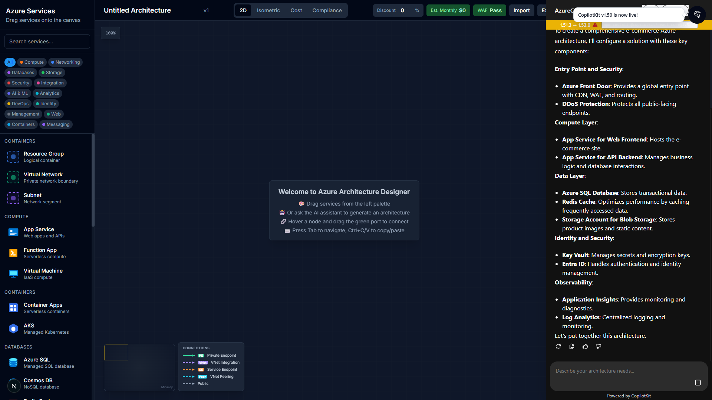
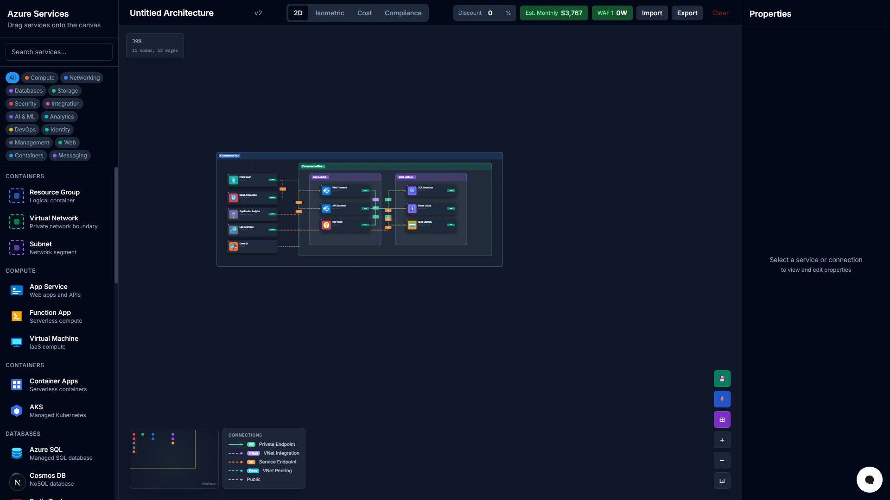
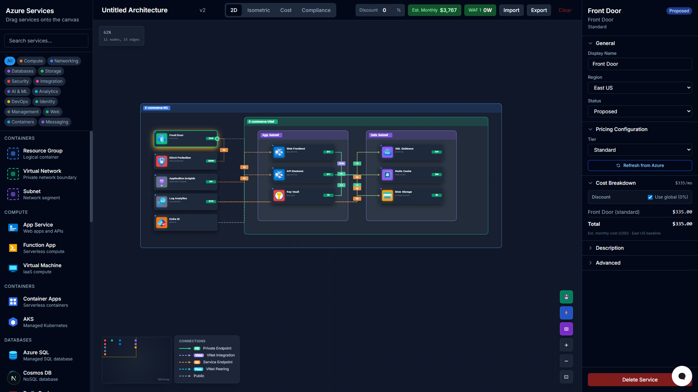
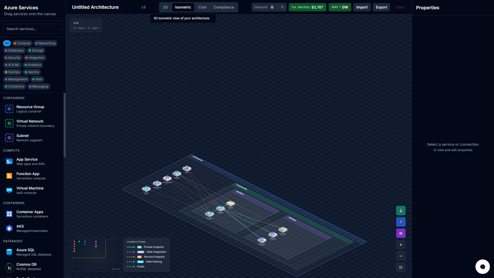
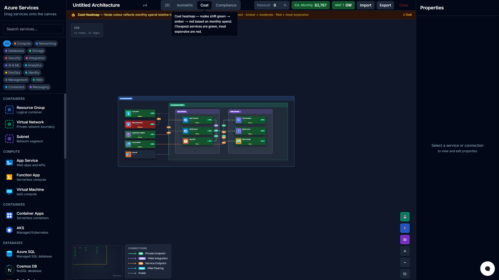

# AzureCraft

AI-powered Azure architecture diagram tool — design, validate, and cost-estimate cloud infrastructure visually.

## Demo


> Describe your architecture in plain English, and AzureCraft builds the diagram — complete with cost estimates, WAF review, and multiple view modes.

### Screenshots

| AI Chat | Architecture | Node Properties |
|---------|-------------|-----------------|
|  |  |  |

| Isometric View | Cost Heatmap |
|---------------|-------------|
|  |  |

---

## What It Does

AzureCraft lets you drag Azure services onto a canvas, connect them, and instantly see:

- **Real-time cost estimates** — per-service pricing with configurable SKUs, tiers, and regions
- **WAF review** — 15 automated Well-Architected Framework rules with findings and severity badges
- **Architecture validation** — auto-fixes common mistakes (e.g. Front Door inside a subnet, orphaned services)
- **Connection inspection** — click any arrow to see from/to details, connection type, and security assessment
- **View modes** — Normal, Cost Heatmap, and Compliance overlay
- **AI generation** — describe an architecture in plain English and CopilotKit builds the diagram

---

## Features

### Canvas
- **Konva-based canvas** with absolute positioning — no React Flow parent-child nesting limitations
- Drag-and-drop from a categorized service palette (26 Azure service types, 705 official icons)
- Pan/zoom, multi-select, keyboard shortcuts (Delete, Ctrl+C/V, Tab, Escape)
- **Drag-from-port connections** — hover a node to reveal the port handle, drag to target
- Alignment tools (align left/center/right/top/middle/bottom, distribute)
- Context menu (copy, duplicate, delete node or edge)
- Export as PNG / Import/Export JSON
- **Click-to-navigate minimap** — click anywhere on the minimap to center the canvas there

### Layout
- **Hierarchy-first tier layout**: Global Services → VNet (App Subnet | Data Subnet)
- Resource Group automatically wraps all containers
- Collision detection skips intentionally nested nodes

### Connections
- Color-coded by type with on-canvas legend:
  - 🟢 **Private Endpoint** — stays on Azure backbone, fully private
  - 🟣 **VNet Integration** — outbound traffic through VNet
  - 🟠 **Service Endpoint** — optimised route, still traverses public IP space
  - 🔵 **VNet Peering** — cross-VNet connectivity
  - ⚪ **Public** — internet-facing
- Orthogonal routing through safe corridors between subnets
- **Fan-out staggering** — multiple edges between the same pair of nodes spread apart so they don't overlap
- Click any arrow to inspect: from/to, connection type, WAF assessment, encrypted status
- **Editable connection type** — change type via dropdown in the Properties panel

### View Modes
- **Normal** — standard dark-card canvas
- **Cost Heatmap** — node backgrounds shift green → amber → red by monthly cost; minimap reflects heat colors
- **Compliance** — node borders and glows reflect WAF finding severity (red = critical, amber = warning, green = clean)

### Cost Estimation
- Per-service pricing descriptors with configurable fields (tier, SKU, capacity, region)
- 10 Azure regions with multipliers
- Live price refresh via Azure Retail Prices API (15-min cache)
- Monthly total displayed in toolbar

### AI Integration
- CopilotKit chat panel — describe what you need in natural English
- `generateArchitecture` action builds a full diagram from a prompt
- Post-generation validator auto-fixes grouping mistakes before committing
- WAF review runs automatically after each generation

### WAF & Compliance
- 15 automated WAF rules across reliability, security, performance, and cost
- Toolbar badges show finding count and cost summary
- Compliance view mode highlights findings directly on affected nodes

---

## Tech Stack

| Layer | Technology |
|-------|-----------|
| Frontend | Next.js 15 (App Router), React 19, TypeScript |
| Canvas | Konva / react-konva |
| AI | CopilotKit, Azure OpenAI (GPT-4) |
| Styling | Tailwind CSS, shadcn/ui |
| Layout | Custom tier-based algorithm (replaces ELK/Dagre) |
| Pricing | Azure Retail Prices API |

---

## Getting Started

### Prerequisites
- Node.js 20+
- npm

### Run locally

```bash
cd apps/web
npm install
npm run dev
```

Open [http://localhost:3000](http://localhost:3000)

### Environment variables

Create `apps/web/.env.local`:

```env
OPENAI_API_KEY=your-key-here
NEXT_PUBLIC_COPILOT_CLOUD_API_KEY=your-key-here   # optional
```

---

## Project Structure

```
AzureCraft/
├── apps/web/
│   ├── app/                        # Next.js App Router
│   │   ├── page.tsx                # Main canvas route
│   │   └── api/pricing/            # Azure Retail Prices proxy
│   ├── components/
│   │   ├── canvas/
│   │   │   ├── KonvaCanvas.tsx     # Main canvas (Konva, ~1800 lines)
│   │   │   └── useCopilotActions.ts # AI actions + validator integration
│   │   ├── palette/                # Service drag palette
│   │   ├── properties/             # Properties + pricing panel
│   │   └── toolbar/                # Toolbar with WAF/cost badges
│   └── lib/
│       ├── state/                  # DiagramContext + DiagramProvider
│       ├── layout/                 # Tier-based layout algorithm
│       ├── validators/             # Architecture auto-fix validator
│       ├── waf/                    # WAF rules engine
│       ├── pricing/                # Pricing descriptors + calculator
│       ├── icons/                  # Azure icon mapping + Konva loader
│       └── azure-icons/            # 705 Azure service SVGs
└── docs/
    └── screenshots/
```

---

## Architecture Decisions

**Why Konva instead of React Flow?**
React Flow's `parentId` parent-child model requires children to use relative positions — fundamentally incompatible with Azure's nested container pattern (Resource Group > VNet > Subnet > Services). Konva uses absolute positioning for all nodes, with group boundaries calculated dynamically as overlays. This matches how Cloudcraft and the Azure Architecture Center draw diagrams.

**Why tier-based layout instead of ELK/Dagre?**
Graph layout algorithms (ELK, Dagre, force-directed) optimise for minimising edge crossings — the wrong objective for architecture diagrams. Professional Azure diagrams use simple left-to-right functional tiers. The custom layout algorithm is faster, more predictable, and produces results that match Microsoft's own reference architectures.

---

## License

MIT
